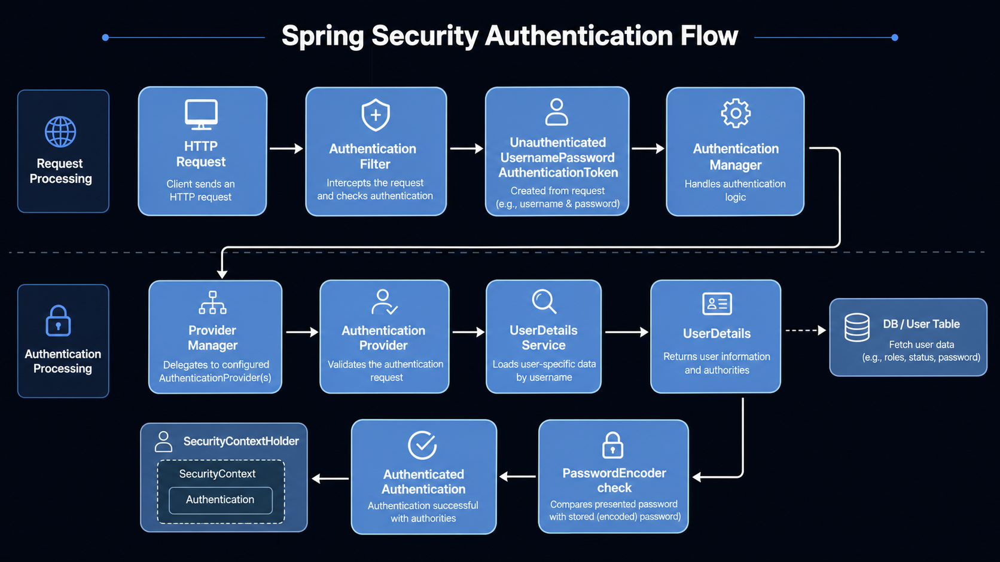

# Spring Security Study

Spring Security를 공부하면서 이 라이브러리를 단순히 설정 몇 줄로 사용하는 것만으로는 전체 흐름을 이해하기 어렵다고 느꼈습니다.

저처럼 Spring Security를 처음 배우며 필터 체인, 인증 객체, SecurityContext, UserDetailsService 같은 개념에서 어려움을 겪는 분들이 있을 것 같아, 학습한 내용을 흐름 중심으로 정리하기 위해 만든 저장소입니다.  
사실 제가 편하려고 만들었습니다.

단순히 예제 코드를 따라 치는 것에서 끝나지 않고, Spring Security가 내부적으로 어떤 흐름으로 동작하는지 이해하고, 나아가 필요한 상황에서 직접 커스텀할 수 있는 힘을 기르는 것을 목표로 합니다.

내용은 공식 문서와 AI의 도움을 함께 참고하여 작성했습니다. 최대한 검증하며 정리하고 있지만, 틀린 부분이 있을 수 있습니다. 잘못된 내용이 있다면 이슈나 PR로 알려주시면 감사하겠습니다.

---

## 시작하기 전에

Spring Security를 이해하기 위해서는 먼저 Servlet Filter와 Security Filter Chain의 흐름을 알아야 한다.

---

## Servlet과 DispatcherServlet, 그리고 Tomcat

우리가 브라우저에서 `localhost:8080/login`과 같은 주소로 요청을 보내면, 그 요청이 곧바로 컨트롤러로 들어가는 것이 아니다.  
시큐리티 라이브러리가 추가되어 있든 아니든 말이다.

큰 흐름으로 보자면 이렇다.

```text
브라우저 요청
-> 톰캣
   -> Servlet Filter Chain
      -> Filter
      -> Filter
      -> Filter
   -> Servlet
      -> DispatcherServlet
         -> Controller
```

사용자의 요청은 먼저 Tomcat과 같은 Servlet Container라고 불리는 녀석에게 전달이 된다.

톰캣은 `Filter`와 `Servlet`을 호출할 수 있는데 먼저 서블릿에 대해 알아보자.

Tomcat은 사용자의 요청을 받는데, 여기서 이 요청을 처리할 **자바 객체**가 필요하다.  
이 역할을 하도록 정해진 표준을 `Servlet`이라고 한다.

한마디로, 서버 안에서 요청을 처리하는 자바 프로그램의 규칙/형태이다.

그런데 "자바 프로그램의 규칙"이라고 두루뭉술 이야기하면 이해가 되지 않을 것이기에 한 번 더 이야기해보자면,

> 톰캣이 호출할 수 있도록 정해진 자바 클래스 작성 규칙이라고 이해하면 된다.

예를 들어 내가 이런 클래스를 만들었다고 해보자.

```java
public class MyPage {

    public void hello() {
        System.out.println("hello");
    }
}
```

톰캣은 이걸 보고 아무것도 할 수가 없다.

```text
톰캣:
요청이 들어왔는데 뭘 호출해야 하지?
hello()? run()?
파라미터는 뭘 써야 하지?
```

그래서 약속이 필요하다.

그 약속이 이런 형태다.

```java
public class MyServlet extends HttpServlet {

    @Override
    protected void doGet(HttpServletRequest request,
                         HttpServletResponse response) {
        // GET 요청 오면 톰캣이 여기 호출
    }
}
```

```text
HTTP GET 요청이 오면 doGet()을 호출한다.
POST 요청이 오면 doPost()를 호출한다.
요청 정보는 HttpServletRequest에 담아서 준다.
응답은 HttpServletResponse에 쓴다.
```

이런 식의 **코드 호출 규칙**이다.

다시다시 한 번 "서블릿이 뭐냐"를 쉽게 말하면,

> 톰캣이 HTTP 요청을 자바 코드로 넘겨주기 위해 정해놓은 클래스 형태이다.

그래서 결론은, 톰캣이 하는 역할은 크게 두 가지로 볼 수 있다.

1. Servlet 구조를 호출할 수 있음
2. Filter를 호출할 수 있음

다시 흐름을 보면 이렇다.

```text
브라우저 요청
-> 톰캣
   -> Servlet Filter Chain
      -> Filter
      -> Filter
      -> Filter
   -> Servlet
      -> DispatcherServlet
         -> Controller
```

저기 보이는 `Servlet Filter Chain`은 이름에 서블릿이 붙었으니 저것도 서블릿 아니야?

> 아님.  
> 그냥 서블릿, 즉 DispatcherServlet까지 도달하기 전에 실행되는 필터들이라 Servlet Filter Chain이라고 부른다.

---

## Spring Security Filter Chain

위에서 요청 흐름을 알아보았는데, 저 흐름에 우리가 사용하는 Security Chain을 등록하여 끼워 넣는 것이다.

```text
톰캣
-> Servlet Filter Chain
   -> DelegatingFilterProxy
      -> Spring Security Filter Chain
         -> SecurityContextHolderFilter
         -> UsernamePasswordAuthenticationFilter
         -> AuthorizationFilter
         -> ...
         -> ...
-> DispatcherServlet
-> Controller
```

기존에 존재하는 서블릿 필터 사이에 시큐리티 필터를 끼워넣는, 이 흐름에 유의하며 따라가야 한다.

`DelegatingFilterProxy`는 톰캣 필터 세계와 Spring Bean 세계를 연결하는 프록시이다.

---

## Register Security Filter Chain

그렇다면 이제 실제 코드로 들어가서 시큐리티를 구현하는 방법을 알아보겠다.

시큐리티 구현 방법에는 크게 세 가지가 있다.

1. formLogin
2. JWT
3. Base64

이를 이해하기 위해선 또 하나의 그림이 필요하다.  
Security Chain의 흐름도인데,



큰 흐름은 위와 같다.

1, 2, 3번 방식 모두 비슷한 흐름이지만 초반 과정에서 조금씩 차이가 있기 때문에, 차이가 있는 곳은 별도로 설명하겠다.

> 자세한 코드 구현 방법은 공식문서나 이 리파지토리의 코드를 참고해주세요.

먼저 security 관련 종속성을 추가해주면 실행 로그 창에 임시 비밀번호가 `asfd-f23f-f23f2...` 이런 식으로 출력될 것이다.

이러면 시큐리티가 잘 걸린 것이다.

지금부터 우리가 해야 할 것은 이제 우리만의 `SecurityFilterChain`을 서블릿 필터 체인 사이에 "끼워넣는" 것이다.

그럼 어떻게 끼워넣냐.

사실 라이브러리를 등록한 것만으로 이미 끼워넣어진 것이다. Spring Security가 알아서 해줄 것이다.

이제 `SecurityFilterChain`을 커스텀하여 작성하기만 하면 된다.

---

## 1. formLogin 방식

```java
@Configuration
public class SecurityConfig {

    @Bean
    public SecurityFilterChain securityFilterChain(HttpSecurity http) {

        return http
                .formLogin(fr -> fr // formLogin 방식 안에 람다 형태로 함수들을 이어준다.
                        .loginPage("/login") // 로그인 창이 나오는 페이지
                        .loginProcessingUrl("/loginProc") // jsp에서 action이 도달하는 url
                        .defaultSuccessUrl("/main", true) // 로그인 성공 시 도달하는 페이지
                )
                .authorizeHttpRequests(auth -> auth
                        .requestMatchers("/login", "/loginProc").permitAll()
                        .requestMatchers("/main").permitAll()
                )
                .csrf(csrf -> csrf.disable())
                .build();
    }
}
```

formLogin 방식은 주로 JSP, SSR 방식에서 쓰인다.

톰캣과 서블릿을 포함한 총 흐름은 이렇다.

```text
Tomcat
-> Servlet Filter Chain
   -> DelegatingFilterProxy
      -> Spring Security Filter Chain
```

이 스프링 시큐리티 체인 안에서 다시 아래 흐름으로 들어오는 것이다.


formLogin 방식은 시큐리티가 제공하는 기본적인 로그인 흐름에 맞게 동작한다.

기본적으로 아래 흐름을 알아서 자동으로 해준다.

```text
AuthenticationFilter
-> UsernamePasswordAuthenticationToken
-> AuthenticationManager
-> AuthenticationProvider
```

따라서 우리는 `AuthenticationManager`나 `AuthenticationProvider`를 직접 크게 신경쓰지 않아도 된다.

`UserDetailsService`와 `UserDetails` 구현체만 작성해주면 되는 것이다.

흐름을 설명하자면, 다음과 같다.

formLogin에서는 로그인 처리 URL로 요청이 들어왔을 때 `UsernamePasswordAuthenticationFilter`가 `username/password`를 꺼내 `UsernamePasswordAuthenticationToken`을 만들고, `AuthenticationManager`에게 인증을 위임한다.

`AuthenticationManager`는 다시 token을 provider에게 넘긴다.

token을 받은 provider는 token에서 id를 뽑아 `UserDetailsService`의 `loadUserByUsername()` 함수를 호출한다.

여기서의 `UserDetailsService`가 우리가 구현해야 하는 곳이다.

```java
@Override
public UserDetails loadUserByUsername(String id) throws UsernameNotFoundException {

    Member member = memberMapper.readMemberById(id);
    List<SimpleGrantedAuthority> simpleGrantedAuthorityList = new ArrayList<>();

    if (member == null) {
        // 던지면 authenticationProvider가 받게 됨
        throw new UsernameNotFoundException("사용자를 찾을 수 없습니다.");
    }

    List<MemberRole> memberRoleList = memberRoleMapper.readMemberRoleById(id);

    for (MemberRole item : memberRoleList) {
        // 저장할 땐 ROLE_를 붙여서 UserDetails 구현체로 넣기
        simpleGrantedAuthorityList.add(new SimpleGrantedAuthority("ROLE_" + item.getRoleName()));
    }

    return MyUser.builder()
            .member(member)
            .name(member.getName())
            .id(member.getId())
            .roles(simpleGrantedAuthorityList)
            .password(member.getPassword())
            .build();
}
```

이 함수를 호출하여 id를 조건으로 하여 DB에 존재하는 사용자 정보를 가져오고, `UserDetails`의 구현체를 리턴해준다.

위 코드에 보이듯이 나는 `MyUser`라는 클래스를 만들어서 구현했다.

이 과정에서 프로바이더가 비밀번호를 대조해야 하기 때문에 `PasswordEncoder`가 필요하다.

```java
@Bean
BCryptPasswordEncoder createPasswordEncoder() {
    return new BCryptPasswordEncoder();
}
```

`SecurityConfig.java`에 위와 같이 구현해주면 스프링 빈에 등록이 되고, provider가 알아서 가져다 쓴다.

이렇게 모든 인증 과정이 끝나고 나면 세션에 `"SPRING_SECURITY_CONTEXT"`라는 이름으로 인증정보가 저장된다.


## 2. JWT 방식

JWT 방식에서는 보통 로그인 요청을 `UsernamePasswordAuthenticationFilter`가 가로채지 않고, 우리가 만든 Controller가 받는다.

정확히 말하면 Spring Security Filter Chain 자체는 지나가지만, formLogin처럼 `UsernamePasswordAuthenticationFilter`가 로그인 요청을 가로채어 인증 처리를 해주지는 않는다는 뜻이다.

다음 흐름은 로그인이 안 되어 있는 사용자의 로그인 요청 흐름이다.

```text
POST /api/login
-> Servlet Filter Chain
   -> Spring Security Filter Chain
      -> Controller
         -> AuthenticationManager
            -> AuthenticationProvider
               -> UserDetailsService
                  -> UserDetails
         -> JWT 발급
```

직접 만든 컨트롤러에서 토큰을 만들어 내려준다.

```java
@PostMapping("/api/login")
public ResponseEntity<?> login(@RequestBody LoginDto dto) {

    // 로그인 요청 때는 id/pw를 token으로 만듦
    UsernamePasswordAuthenticationToken token =
            new UsernamePasswordAuthenticationToken(dto.getId(), dto.getPassword());

    // 인증 성공 시 authentication으로 돌려받고 이걸로 JWT를 만드는 것
    // provider가 이 token에서 id를 뽑아 UserDetailsService를 호출
    Authentication authentication = authenticationManager.authenticate(token);

    String jwt = jwtTokenProvider.createToken(authentication);

    return ResponseEntity.ok(new LoginResponse(jwt));
}
```

formLogin 방식에서 보았던 `UsernamePasswordAuthenticationToken`을 직접 컨트롤러에서 만들어 `AuthenticationManager`를 호출하는 것을 볼 수 있다.

`AuthenticationManager`를 호출하면 내부적으로 provider가 호출되고, 그 다음부터는 formLogin 방식과 동일한 흐름으로 이어진다.

```text
AuthenticationManager
-> AuthenticationProvider
   -> UserDetailsService.loadUserByUsername()
      -> UserDetails 구현체 반환
```

JWT 방식에서는 로그인 요청 시점에 `SecurityContextHolder`를 세팅하지 않아도 된다.

왜냐하면 로그인 요청의 목적은 "이번 요청을 인증 상태로 계속 처리"하는 게 아니라, **토큰 발급**이기 때문이다.

---

다음은 JWT를 들고 서버에 요청하는 흐름이다.

```http
GET /api/me
Authorization: Bearer JWT
```

```text
GET /api/me
-> Servlet Filter Chain
   -> Spring Security Filter Chain
      -> JwtAuthenticationFilter
         -> 토큰 검증
         -> SecurityContextHolder 세팅
      -> Controller
```

이때는 토큰을 검사해야 하기 때문에 Security Chain 안에 하나의 필터를 더 끼워넣는 것을 볼 수 있다.

사용자가 가져온 토큰을 보고 유효성과 만료 여부를 확인 후, 인증 정보를 `SecurityContextHolder`에 세팅한다.

```java
@Override
protected void doFilterInternal(
        HttpServletRequest request,
        HttpServletResponse response,
        FilterChain filterChain
) throws ServletException, IOException {

    String header = request.getHeader("Authorization");

    if (header != null && header.startsWith("Bearer ")) {
        String token = header.substring(7);

        if (jwtTokenProvider.validateToken(token)) {
            String id = jwtTokenProvider.getId(token);

            MyUser myUser =
                    (MyUser) myUserDetailsService.loadUserByUsername(id);

            // JWT를 들고 온 요청에서는 인증 객체를 내가 직접 만들어 넣어야 함
            UsernamePasswordAuthenticationToken authenticationToken =
                    new UsernamePasswordAuthenticationToken(
                            myUser,
                            null,
                            myUser.getAuthorities()
                    );

            SecurityContextHolder.getContext()
                    .setAuthentication(authenticationToken);
        }
    }

    filterChain.doFilter(request, response);
}
```

위처럼 `UsernamePasswordAuthenticationToken`을 직접 다시 만들고, `SecurityContextHolder`에 인증 정보를 세팅해주는 것을 볼 수 있다.

---

## 3. Basic Login 방식

Basic 방식은 formLogin처럼 로그인 페이지를 보여주고 form을 submit하는 방식이 아니다.

클라이언트가 요청을 보낼 때마다 `Authorization` 헤더에 id와 password를 Base64로 인코딩해서 함께 보내는 방식이다.

```http
Authorization: Basic base64(id:password)
```

Basic 방식의 흐름은 다음과 같다.

```text
Client Request
-> Servlet Filter Chain
   -> Spring Security Filter Chain
      -> BasicAuthenticationFilter
         -> Authorization 헤더 확인
         -> Base64 디코딩
         -> UsernamePasswordAuthenticationToken 생성
         -> AuthenticationManager에게 인증 위임
            -> AuthenticationProvider
               -> UserDetailsService
               -> PasswordEncoder로 비밀번호 비교
         -> 인증 성공 시 SecurityContextHolder에 Authentication 저장
-> DispatcherServlet
-> Controller
```

다른 로그인 방식처럼 앞부분만 다를 뿐, 큰 흐름은 비슷하다.

Basic 방식에서 사용하는 Base64는 암호화가 아니다. 단순 인코딩이기 때문에 쉽게 원래 문자열로 되돌릴 수 있다.

따라서 Basic 인증을 사용할 때는 반드시 HTTPS와 함께 사용해야 한다.